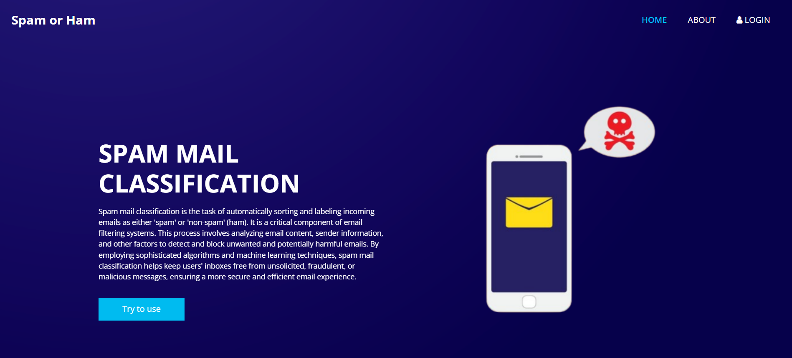
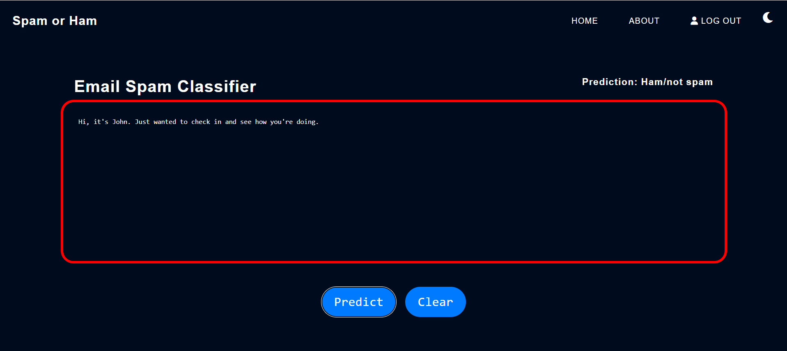

# Spam Mail Classification 


## Description

The **Spam Mail Classification** project is a web-based application that uses machine learning to classify emails as spam or ham. It features a Flask backend, a frontend created with HTML, CSS, and JavaScript, and a MySQL database for storing user data and email classifications.

### Features

- **Email Classification**: Categorizes incoming emails as spam or ham.
- **User Registration and Login**: Secure account creation and authentication.
- **Real-Time Email Classification**: Classifies emails in real time.
- **User Dashboard**: Users can view their email history and classifications.
- **Machine Learning Model**: Employs a trained model to classify emails.
- **Customization**: Users can configure spam filter settings.

## Technologies Used

- **Flask** (Python Web Framework): For the backend server.
- **HTML, CSS, and JavaScript** (Frontend): For the user interface.
- **MySQL** (Database): For storing user data and email classifications.
- **Machine Learning Libraries** (e.g., Scikit-Learn): Used to build and deploy the email classification model.

## Getting Started

To use the Spam Mail Classification app, follow these steps:

1. **Clone this Repository**: Get the project source code by cloning this repository to your local machine.

2. **Set Up the Flask Backend and MySQL Database**:
   - Refer to the documentation or instructions provided in the code for setting up the Flask backend and MySQL database.

3. **Install Required Python Packages**:
   - You'll need to install a few Python packages using pip. Open your terminal and run:

   ```bash
   pip install Flask
   pip install nltk
   pip install mysql-connector-python
   ```

5. **Create a MySQL Database and Table**:
   - Set up the MySQL database and table by running the following SQL commands in your MySQL server:

   ```sql
   CREATE DATABASE smc;
   ```

    ```sql
   USE smc;
   ```

   ```sql
   CREATE TABLE users (
       id INT AUTO_INCREMENT PRIMARY KEY,
       full_name VARCHAR(255) NOT NULL,
       username VARCHAR(255) UNIQUE NOT NULL,
       email VARCHAR(255) UNIQUE NOT NULL,
       phone VARCHAR(15) NOT NULL,
       password VARCHAR(255) NOT NULL
   );
   ```

6. **Run the Flask App**:
   - Start the Flask app by running the following command in your terminal:

   ```bash
   python app.py
   ```

   - Goto browser to open this website in Localhost:

   ```bash
   http://127.0.0.1:5000/
   ```
The HTML template is taken from https://html.design/ .

